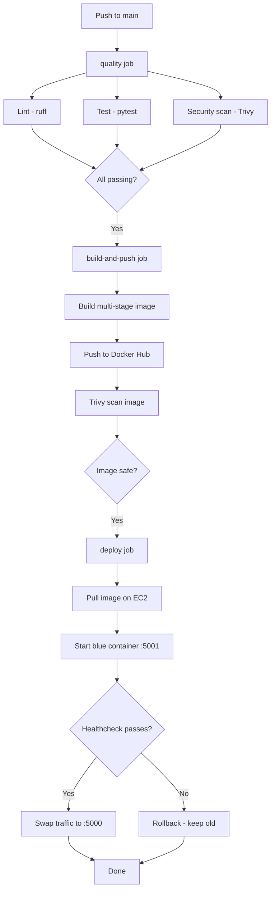
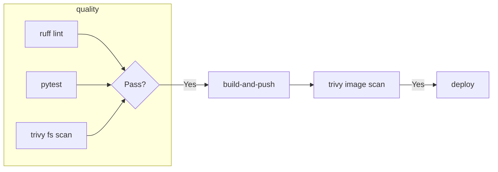
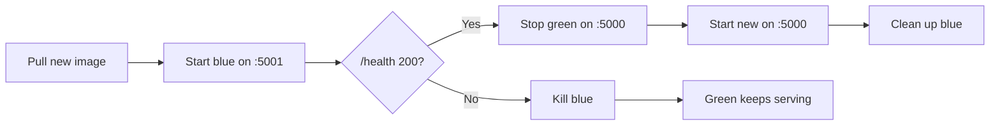

# cicd-demo


A CI/CD pipeline demo — minimal Flask API built, tested, scanned, containerized, and deployed with zero downtime on every push to `main`.

---

## Pipeline Architecture



---

## Pipeline Breakdown

### Jobs

| Job | Trigger | Runs on | Purpose |
|-----|---------|---------|---------|
| `quality` | PR + push to `main` | ubuntu-latest | Lint, test, vulnerability scan |
| `build-and-push` | `main` only | ubuntu-latest | Build multi-stage image, push to Docker Hub |
| `deploy` | `main` only (after push) | appleboy/ssh-action | Blue-green deploy on EC2 |

### Quality Gates

All three run in parallel within the `quality` job. Deploy only fires if every gate passes.



| Gate | Tool | What it catches |
|------|------|----------------|
| Lint | `ruff` | Code style, unused imports, common mistakes |
| Tests | `pytest` | Functional correctness |
| Dependency scan | `trivy fs` | CVEs in Python packages (HIGH/CRITICAL) |
| Image scan | `trivy image` | CVEs in the final Docker image |

### Caching

- **pip cache** — `actions/cache@v4` restores pip cache between runs, keyed on `requirements.txt` hash
- **Docker layer cache** — `docker/build-push-action` uses local buildx cache, shared across workflow runs

### Supply Chain Security

All third-party GitHub Actions are pinned to **immutable commit SHAs** instead of version tags:

| Action | Pinned SHA |
|--------|-----------|
| `aquasecurity/trivy-action` | `57a97c7` (v0.35.0 — the only tag untouched by the March 2026 supply chain attack) |
| `appleboy/ssh-action` | `029f5b4` (v1.0.3) |

Git tags are mutable — an attacker can force-push a different commit to an existing tag. By pinning to a commit SHA, the workflow always runs the exact reviewed code, regardless of whether a tag is later moved or compromised.

---

## Docker

### Multi-Stage Build

| Stage | Base Image | Contents | Purpose |
|-------|-----------|----------|---------|
| `builder` | `python:3.12-slim` | Source + installed deps | Compile and assemble |
| `runtime` | `python:3.12-slim` | Copied `site-packages` + app only | Minimal runtime image |

The final image contains only what is needed at runtime — no build tools, no caches, no source history. This reduces attack surface and deploy time.

### HEALTHCHECK

```dockerfile
HEALTHCHECK --interval=30s --timeout=3s --start-period=10s --retries=3 \
  CMD python -c "import urllib.request; urllib.request.urlopen('http://localhost:5000/health')"
```

Docker marks the container `healthy` or `unhealthy` — the deploy script uses this for the blue-green swap decision.

### Image Tagging Strategy

| Tag | Format | Use |
|-----|--------|-----|
| Commit | `sha-<7-char-sha>` | Immutable, traceable to exact commit |
| Latest | `latest` | Updated on every `main` push |

Images are pushed to **Docker Hub**: [`pavara/cicd-demo`](https://hub.docker.com/r/pavara/cicd-demo)

---

## Deploy Strategy: Blue-Green



The deploy script on EC2:

1. Pulls `pavara/cicd-demo:sha-<commit>`
2. Starts a new container (`cicd-demo-blue`) on port **5001**
3. Waits up to 60 seconds for the healthcheck to pass
4. If healthy — stops the old container on port 5000, starts the new container on port 5000, removes the blue container
5. If unhealthy — kills the blue container, exits with error. The old container keeps serving.

**Zero downtime.** No traffic loss during deploys.

---

## Reproduce It Yourself

```bash
# 1. Fork this repo on GitHub
# 2. Set these repository secrets:
#    DOCKER_USERNAME     - Docker Hub username
#    DOCKER_PASSWORD     - Docker Hub token (not your password)
#    EC2_HOST            - EC2 public IP
#    EC2_USER            - usually "ubuntu"
#    EC2_SSH_KEY         - private SSH key for EC2
# 3. Push to main — the pipeline runs automatically
```

### EC2 Requirements

- Ubuntu 24.04
- Docker installed (`sudo apt install docker.io`)
- Port 5000 open in security group

---

## Running Locally

```bash
make install     # install dependencies
make test        # run tests
make lint        # ruff check
make scan        # trivy filesystem scan
make docker-build
make ci          # lint + test + scan — same as the CI quality gate
```

Or step by step:

```bash
python3 -m venv .venv && source .venv/bin/activate
pip install -r requirements.txt
pytest -v
python app.py
```

App at `http://localhost:5000`

---

## Endpoints

| Method | Path | Status | Response |
|--------|------|--------|----------|
| GET | `/` | 200 | `{"status": "ok", "message": "hello from cicd-demo"}` |
| GET | `/health` | 200 | `{"healthy": true}` |
| GET | `/anything-else` | 404 | `{"error": "not found"}` |
| Any | `/error` | 500 | `{"error": "internal server error"}` |

---

## Project Structure

```
cicd-demo/
├── app.py                  # Flask app
├── test_app.py             # pytest tests
├── requirements.txt        # Pinned dependencies
├── Dockerfile              # Multi-stage build
├── Makefile                # Dev commands
├── .dockerignore           # Image exclusions
├── .gitignore              # Git exclusions
└── .github/workflows/
    └── ci.yml              # CI/CD pipeline (3 jobs, 5 quality gates)
```

---

## Project secrets reference

| Secret | Used by | Purpose |
|--------|---------|---------|
| `DOCKER_USERNAME` | `build-and-push` | Docker Hub login |
| `DOCKER_PASSWORD` | `build-and-push` | Docker Hub access token |
| `EC2_HOST` | `deploy` | EC2 public IP address |
| `EC2_USER` | `deploy` | SSH username |
| `EC2_SSH_KEY` | `deploy` | SSH private key |

---

## Competencies demonstrated

| Skill | Evidence in this project |
|-------|--------------------------|
| **CI/CD** | Multi-job GitHub Actions pipeline — quality gates, conditional deploys, caching |
| **Docker** | Multi-stage build, `HEALTHCHECK`, `.dockerignore`, layer caching, registry push/pull |
| **Deploy strategies** | Blue-green with health-gated traffic swap and automatic rollback |
| **Security** | Trivy vulnerability scanning at the dependency and container image levels |
| **Supply chain security** | All actions pinned to commit SHAs (not mutable tags) — protection against tag hijacking attacks |
| **Cloud (AWS)** | EC2 provisioning, security group config, SSH-based deployment |
| **Pipeline performance** | pip caching, Docker layer caching, parallel job execution |
| **Production readiness** | Health endpoint, JSON error handlers, CORS, structured tagging, zero-downtime deploys |
